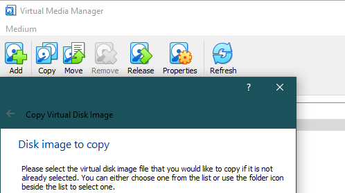

# Linux hyper-v guest

## Screen resolution

Follow these steps to change the screen resolution:

1. From within the Ubuntu virtual machine, open Terminal
2. Type sudo vi /etc/default/grub
3. Find GRUB\_CMDLINE\_LINUX\_DEFAULT="quiet splash"
4. Append that line with video=hyperv\_fb:\[specify resolution, e.g. 1024x768\]
5. Here is what it might look like: GRUB\_CMDLINE\_LINUX\_DEFAULT="quiet splash video=hyperv\_fb:1024x768"
6. Save changes and exit
7. Run the following command: sudo update-grub
8. Restart the VM

## Migrate from VirtualBox

1. Create a new VM without disk image.
2. Convert `.vdi` image to `.vhd`image.
3. If encounter failed booting because of video driver, try booting to recovery mode and setting to boot to cmd line by default. Run `startx` to boot to GUI afterwards may fix the problem.

Convert `.vdi` to `.vhd`

## References

1. [How To Change the Resolution of an Ubuntu Hyper-V Virtual Machine](https://virtualizationreview.com/blogs/virtual-insider/2014/09/change-ubuntu-resolution-on-hyper-v-vm.aspx)

