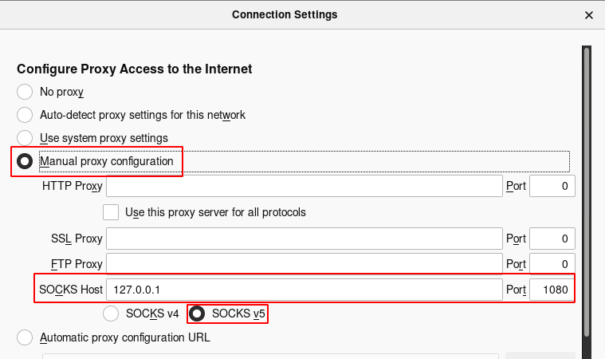

# SSH (OpenSSH)

## Start SSH Server

### Linux

Enable

`sudo systemctl enable ssh.service`

Start

`sudo service ssh start`

Restart

`sudo service ssh restart`

### Windows

#### WSL

```bash
# To remove old config file and to enable GSSAPIAuthentication
sudo apt remove openssh-server
sudo apt install openssh-server

sudo service ssh --full-restart
```

## SSH Configuration

### Client

URL: `~/.ssh/config`

Example

```bash
Host localssh
  HostName 127.0.0.1
  Port 22
  User user
  IdentityFile ~/.ssh/id_ed25519
```

`> ssh localssh`

### Server

Linux/Unix URL: `/etc/ssh/sshd_config`

## Key Management

### Create key

```
ssh-keygen -t ed25519 -f id_ed25519
```

### Import key

Need to allow `PasswordAuthentication` temporarily. For Linux:

```bash
ssh-copy-id -i ~/.ssh/id_ed25519.pub user@server
```

For Windows PowerShell

```powershell
type $env:USERPROFILE\\.ssh\\id_rsa.pub | ssh {IP-ADDRESS-OR-FQDN} \"cat >> .ssh/authorized_keys"
```

## SOCKS Proxy

```
ssh -D 1080 -q -C -N user@host
```

1. `-D 1080`: open a SOCS proxy on local port `:1080`
2. `-C`: compress data in the tunnel, save bandwidth
3. `-q`: quite mode, don't output anything locally
4. `-N`: do not execute remote commands or open shell

Firefox setting



.png>)

## References

1. [socks proxy linux ssh bypass content filters](https://ma.ttias.be/socks-proxy-linux-ssh-bypass-content-filters/)
